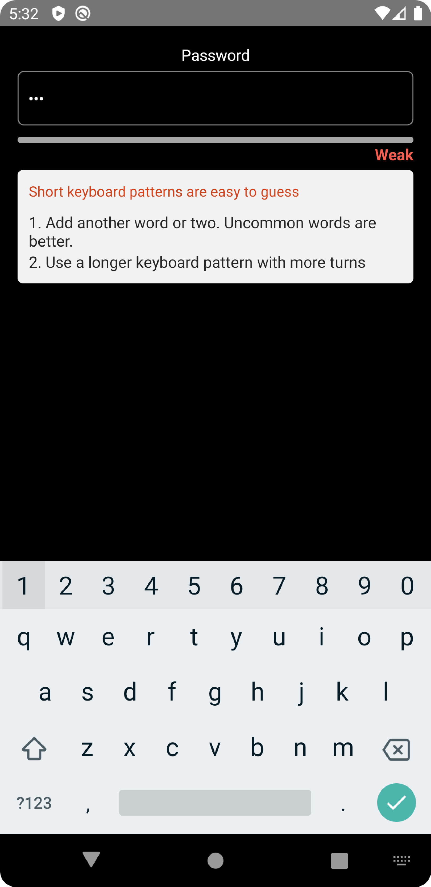
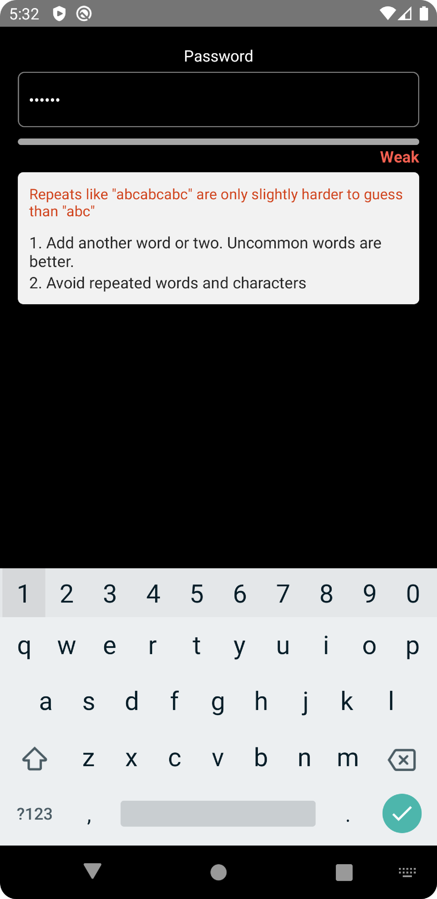
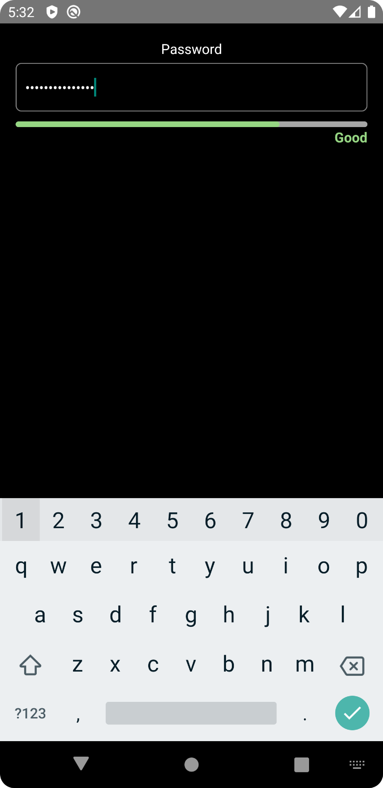
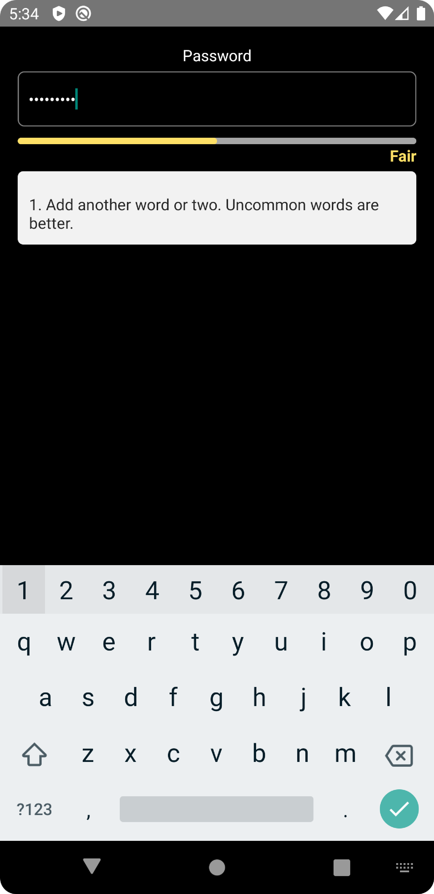

# React Native Password Meter 🔐

[](https://www.npmjs.com/package/react-native-password-meter)
[](https://www.npmjs.com/package/react-native-password-meter)
[](https://www.npmjs.com/package/react-native-password-meter)
[](https://github.com/srivastavaanurag79/react-native-password-meter)
[](https://www.typescriptlang.org/)
[](https://reactnative.dev/)

- Password Strength Meter for your passwords with suggestions in **React Native**.
- The package is both **Android** and **iOS** compatible.
- The package is well-typed and supports **TypeScript**.
- Smooth and fast.
- Type-safe

**Give us a GitHub star 🌟, if you found this package useful.**
[](https://github.com/srivastavaanurag79/react-native-password-meter)

[React Native Password Meter (NPM Link)](https://www.npmjs.com/package/react-native-password-meter)

## Would you like to support me?

<a href="https://www.buymeacoffee.com/pixmita"></a>

## Demo/Screenshots

<p float="left">

  
  
  
</p>

## Dependencies

```bash
zxcvbn
react-native-animated-progress

Please make sure you have installed these package.
```

## Installation

```bash
npm install react-native-password-meter
```

or

```bash
yarn add react-native-password-meter
```

## Basic Usage

```js
import { PasswordMeter } from 'react-native-password-meter';

// ...

  const [password, setPassword] = React.useState({ value: '', error: '' });
  const [passwordScore, setPasswordScore] = React.useState(0);
  const _updateScore = (val: any) => {
    setPasswordScore(val);
  };

  <TextInput
    style={{
      height: 50,
      borderColor: 'gray',
      borderWidth: 1,
      width: '100%',
      borderRadius: 6,
      color: 'white',
      padding: 10,
    }}
    returnKeyType="done"
    value={password.value}
    onChangeText={(text) => setPassword({ value: text, error: '' })}
    secureTextEntry={true}
  />
  <PasswordMeter
    password={password.value}
    onResult={(val) => {
    _updateScore(val);
    }}
  />
```

### Props

| props                      | type                                                                                                                                                                       | description                                                                                                          | default value                                                                      | required |
| -------------------------- | -------------------------------------------------------------------------------------------------------------------------------------------------------------------------- | -------------------------------------------------------------------------------------------------------------------- | ---------------------------------------------------------------------------------- | -------- |
|   password                    | string                                                                                                                                                                     | password value                                                                                                          | pass the password to this variable to get checked                                   | yes      |


### Callback Methods

- `onResult` - Return the password score.
  Example :

  ```ts
  onResult={(val) => {
    _updateScore(val);
  }}

  const _updateScore = (val: any) => {
    setPasswordScore(val);
  };
  ```

## Score Analysis

```
Score 0: 'Weak'
Score 1: 'Weak'
Score 2: 'Fair'
Score 3: 'Good'
Score 4: 'Strong'

Based on your requirement disable the submit button according to the score.

Let say if your preferred score is 3 then you can disable the submit button if the score is less than 3.

```

## Example

```ts
/* eslint-disable react-native/no-inline-styles */
import * as React from 'react';
import { StyleSheet, View, Text, TextInput } from 'react-native';
import { PasswordMeter } from 'react-native-password-meter';

export default function App() {
  const [password, setPassword] = React.useState({ value: '', error: '' });
  const [passwordScore, setPasswordScore] = React.useState(0);
  const _updateScore = (val: any) => {
    setPasswordScore(val);
  };
  return (
    <View style={styles.container}>
      <Text style={{ color: 'white', marginBottom: 5 }}>Password</Text>
      <TextInput
        style={{
          height: 50,
          borderColor: 'gray',
          borderWidth: 1,
          width: '100%',
          borderRadius: 6,
          color: 'white',
          padding: 10,
        }}
        returnKeyType="done"
        value={password.value}
        onChangeText={(text) => setPassword({ value: text, error: '' })}
        secureTextEntry={true}
      />
      <PasswordMeter
        password={password.value}
        onResult={(val) => {
          _updateScore(val);
        }}
      />
      <Text>{passwordScore}</Text>
    </View>
  );
}

const styles = StyleSheet.create({
  container: {
    flex: 1,
    justifyContent: 'center',
    padding: 16,
    backgroundColor: '#000',
    alignItems: 'center',
  },
  box: {
    width: 60,
    height: 60,
    marginVertical: 20,
  },
});

```

You can check the example source code in [example module](https://github.com/srivastavaanurag79/react-native-password-meter/tree/master/example).

## Try it out

You can run the example module by performing these steps:

```
git clone https://github.com/srivastavaanurag79/react-native-password-meter.git
cd react-native-password-meter && cd example
npm install
cd ios && pod install && cd ..
react-native run-ios
react-native run-android
```

## Authors

- Anurag Srivastava [(@srivastavaanurag79)](https://github.com/srivastavaanurag79)

## Contributing

See the [contributing guide](CONTRIBUTING.md) to learn how to contribute to the repository and the development workflow.

## License

MIT
